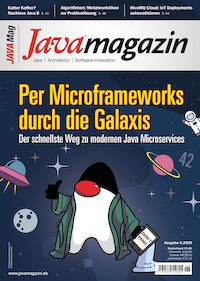

# Samples of JVM-Microframeworks 
  
This repository contains several _"Hello World"_ examples of JVM-Microframeworks.

This includes all code fragments of [Carlos'](https://github.com/carlosbarragan) and my Java Magazin
lead article 
[Per Microframeworks durch die Galaxis -Der schnellste Weg zu modernen Java-Microservices](https://kiosk.entwickler.de/java-magazin/java-magazin-6-2020/) 
(edition 06.2020).

You read find the article 
[here](https://kiosk.entwickler.de/java-magazin/java-magazin-6-2020/per-microframeworks-durch-die-galaxis/) 
as well as the introduction to the different frameworks 
[here](https://kiosk.entwickler.de/java-magazin/java-magazin-6-2020/alle-neune/).

## Presented frameworks
#### Micronaut
* See [micronaut](https://github.com/csh0711/jvm-microframeworks-hello-world/tree/master/micronaut)
#### Quarkus.io
* See [quarkus](https://github.com/csh0711/jvm-microframeworks-hello-world/tree/master/quarkus)
#### Javalin
* See [javalin](https://github.com/csh0711/jvm-microframeworks-hello-world/tree/master/javalin)
#### Ktor
* See [ktor](https://github.com/csh0711/jvm-microframeworks-hello-world/tree/master/ktor)
#### Eclipse Vert.x
* See [vertx](https://github.com/csh0711/jvm-microframeworks-hello-world/tree/master/vertx)
#### http4k
* See [http4k](https://github.com/csh0711/jvm-microframeworks-hello-world/tree/master/http4k)
#### Spring Fu
* See [spring-fu](https://github.com/csh0711/jvm-microframeworks-hello-world/tree/master/spring-fu)
#### Ratpack
* See [ratpack](https://github.com/csh0711/jvm-microframeworks-hello-world/tree/master/ratpack)
#### Helidon
* See [helidon](https://github.com/csh0711/jvm-microframeworks-hello-world/tree/master/helidon)

## Scenario  
Every example contains a REST endpoint `http://localhost:8080/hello` which returns a plain text response via _GET_.

Just start the application from the command line or your favourite IDE and open the URL `http://localhost:8080/hello` 
with your browser or REST client.

## Advanced examples
If you need a bit more than just _"Hello World"_ - please have a look at my other 
[repository with Kotlin / MongoDB samples](https://github.com/csh0711/jvm-microframeworks-kotlin-samples).
